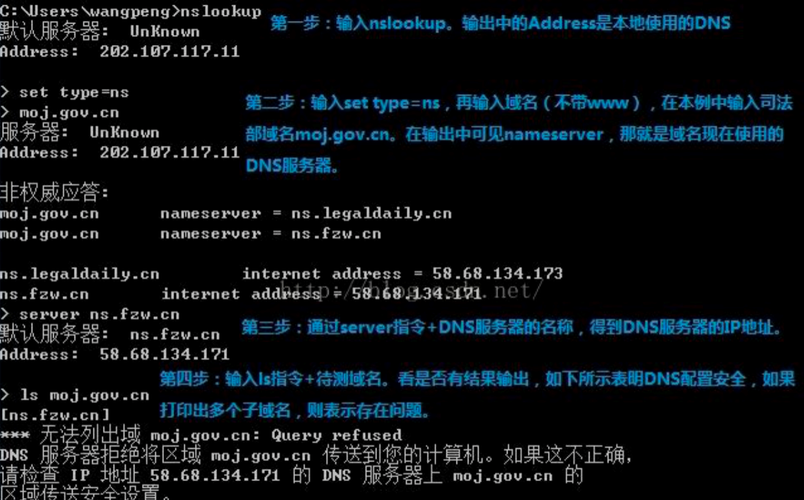

## 系统漏洞及修复方案

## 1.DNS域传送漏洞

###  漏洞描述：

网站DNS服务器配置不当，使得攻击者可获取DNS数据库的详细信息，导致所有域名DNS泄露，从而引起进一步的入侵。DNS主备之间的数据同步就会用到dns域传送，但如果配置不当，就会导致任何匿名用户都可以获取DNS服务器某一域的所有记录，将整个企业的基础业务以及网络架构对外暴露从而造成严重的信息泄露，甚至导致企业网络被渗透。

### 漏洞测试：

如dns服务器IP：1.1.1.1 测试域名为wooyun.org，测试命令如下：



### 漏洞危害：

可导致攻击者获取DNS服务器某一域的所有记录，将整个单位的基础业务以及网络架构对外暴露从而造成严重的信息泄露，甚至导致内部网络被渗透；

攻击者可快速的判定出某个特定zone的所有主机，收集域信息，选择攻击目标，找出未使用的IP地址，攻击者可以绕过基于网络的访问控制。

### 修复方案：

 

严格限制允许区域传送的主机，例如一个主DNS服务器应该只允许它的从DNS服务器执行区域传送的功能；

在相应的zone、options中添加allow-transfer限制可以进行同步的服务器，有两种方式：限制IP、使用key认证。优先级为如果zone没有进行配置，则遵守options的设置。如果zone进行了配置，则遵守zone的设置。

## 2.SSH Services Port 22 Enabled

### 漏洞等级：中危

### 漏洞描述：

22号端口是linux服务器默认的远程登录管理端口，开放该端口可导致攻击者暴力破解服务器口令，若存在弱口令可直接被攻击者入侵。

### 漏洞危害：

黑客可能通过22端口试图连接远程控制；

如果主机的管理员密码过于简单，黑客就可以利用该漏洞，通过一些工具破解管理员密码，进而控制服务器。

### 漏洞修复方案：

建议利用组策略等方法关闭22端口。

部署防火墙拦截内网端口。

## 3.etBIOS Services Port 139 Enabled

### 漏洞描述：

即139端口漏洞，可通过139端口访问IPC$服务。

### 漏洞危害：

黑客可能通过139端口试图连接NetBIOS/SMB服务；

如果主机的管理员密码过于简单，黑客就可以利用该漏洞，通过一些工具破解管理员密码，进而控制服务器。

### 修复方案：

建议利用组策略等方法关闭139端口；

部署防火墙拦截内网端口。

## 4.OpenSSL HeartBleed**漏洞**

### 漏洞描述：

由于未能在memcpy()调用受害用户输入内容作为长度参数之前正确进行边界检查。攻击者可以追踪OpenSSL所分配的64KB缓存、将超出必要范围的字节信息复制到缓存当中再返回缓存内容，这样一来受害者的内存内容就会以每次64KB的速度进行泄露。

请求包中的数据实际长度远远小于其标明的length长度，Server端根据其标明的length长度分配了堆，然后尝试将请求包中的数据都拷贝过来形成回应包，于是便从内存中的请求包数据处开始复制了length个长度的字节，已经远远超过了数据的实际长度，从而造成数据的泄露。通过这种方式，一般可以得到SSL使用的Server端的私钥，从而获得SSL会话密钥，以及用户的账号等信息，最多64KB的数据。

### 漏洞危害：

攻击者可利用该漏洞直接读取服务器数据；

### 修复建议：

升级OpenSSL到最新版本。

使用DEPENSSL_NO_HEARTBEATS参数重新编译低版本的OpenSSL以禁用Heartbleed模块。

删除OpenSSL组件。

## **5.**docker remote API**漏洞**

### 漏洞描述：

docker是一种开源的应用容器引擎，这个漏洞是利用docker对外开放的一个api接口，因为权限设置不当，导致可以远程命令执行。

### 漏洞测试：

首先探测2375端口，如果开放，再构造http:localhost:2375/version请求，如果返回包带有json格式，说明存在该漏洞。

进一步测试，这里不再说明。

### 漏洞危害：

通过此漏洞，可在docker命令执行，并且影响宿主机。

### 漏洞修复：

1.关闭2375端口

## **6.**openssl**公钥密码过弱漏洞**

### 漏洞描述：

openssl协议使用的公钥太弱，导致被暴力猜解。

### 漏洞检测：

使用：openssl s_client -connect  122.227.230.67:60008 —ssl3

其支持的版本探测：

-ssl2         - just use SSLv2

-ssl3         - just use SSLv3

-tls1_2       - just use TLSv1.2

-tls1_1       - just use TLSv1.1

-tls1         - just use TLSv1

-dtls1        - just use DTLSv1

检测原理：用openssl尝试去连接，如果返回

eer signing digest: SHA512

Server Temp Key: ECDH, P-256, 256 bits

​    

SSL handshake has read 1413 bytes and written 458 bytes

​    

New, TLSv1/SSLv3, Cipher is ECDHE-RSA-AES128-SHA

Server public key is 2048 bit

Secure Renegotiation IS supported

Compression: NONE

Expansion: NONE

No ALPN negotiated

SSL-Session:

```
Protocol  : TLSv1.2

Cipher    : ECDHE-RSA-AES128-SHA

Session-ID: 58E72FA84E256939BC49FB68087AC9065E071C4BE557DBF99D40270E70D9F674

Session-ID-ctx:

Master-Key: EF828328DBDA5C9E5B187C483C1A526D1C052FBC16C6CBC8DB90544E0751FBD28F8A9D081101A6675A9DFC3AF33708BC

Key-Arg   : None

PSK identity: None

PSK identity hint: None

SRP username: None

Start Time: 1491546024

Timeout   : 300 \(sec\)

Verify return code: 18 \(self signed certificate\)
```

​    

说明连接成功，里面包含一些信息，如果返回

140735260164176:error:1409E0E5:SSL routines:ssl3_write_bytes:ssl handshake failure:s3_pkt.c:656:

表示握手失败。

### 漏洞修复：

升级openssl为最新版本，使用ssl3版本。

## **7.**OpenSSL ASN.1**编码器内存破坏漏洞**

### 漏洞描述：

OpenSSL中的ASN.1解析器在对数据解析时没有正确处理特定标签，当遇到V_ASN1_NEG_INTEGER和V_ASN1_NEG_ENUMERATED标签时，ASN.1解析器也会将其视作ASN1_ANY类型，从而解析其中的数据。当数据再次编码序列化时，可能造成数据越界写入，引起内存损坏。

**受影响系统：**

OpenSSL Project OpenSSL 1.0.2

OpenSSL Project OpenSSL 1.0.1

**不受影响系统：**

OpenSSL Project OpenSSL 1.0.2c

OpenSSL Project OpenSSL 1.0.1o

### 漏洞检测：

基于openssl版本检测

### 漏洞修复：

升级openssl

## **8.**OpenSSL AES-NI CBC Padding Oracle MAC漏洞

### 漏洞描述：

OpenSSL 1.0.2, 1.0.1版本未充分修补CVE-2013-0169（Lucky 13 padding attack）漏洞。可使中间人攻击者解密使用AES CBC模式加密的网络流量。此漏洞源于在CVE-2013-0169的修复中, 虽然通过对填充字段的检查，确保每次都读取相同字节并比较消息摘要和填充字节的数据, 但其没有检查是否有足够的空间容纳消息摘要和填充字节的数据。

**受影响系统：**

OpenSSL Project OpenSSL <1.0.2h

OpenSSL Project OpenSSL <1.0.1t

**不受影响系统：**

OpenSSL Project OpenSSL 1.0.2h

OpenSSL Project OpenSSL 1.0.1t

### 漏洞检测：

基于openssl版本检测

### 漏洞修复：

升级openssl版本

## **9.**Samba**远程代码执行漏洞**

### 漏洞描述：

Samba是Linux和UNIX系统的SMB协议服务软件，可以实现与其他操作系统（如：微软Windows操作系统）进行文件系统、打印机和其他资源的共享。此次漏洞最早影响到7年前的版本，黑客可以利用漏洞进行远程代码执行。

##### 漏洞影响版本：Samba 3.5.0到4.6.4/4.5.10/4.4.14的中间版本。

### 漏洞检测：

基于samba版本的检测

### 漏洞危害：

可导致安装了samba服务的服务器被远程命令执行

### 漏洞修复：

1.打相关补丁

2.升级到Samba 4.6.4/4.5.10/4.4.14任意版本

3.在smb.conf的[global]板块中添加参数：nt pipe support = no 然后重启smbd服务。

## **10.**SMB远程命令执行漏洞

### 漏洞描述：

windows系统如果开启了SMB协议，可以实现与其他机子进行文件系统、打印机和其他资源的共享，黑客可以利用漏洞进行远程代码执行。

### 漏洞检测：

windows服务器开启了445端口，且没有打MS17-010补丁的即存在此漏洞

### 漏洞危害：

可导致开启了SMB服务的服务器被远程命令执行

### 漏洞修复：

1.关闭445端口，或者上防护设备限制特定ip访问。

2.打微软MS17-010补丁